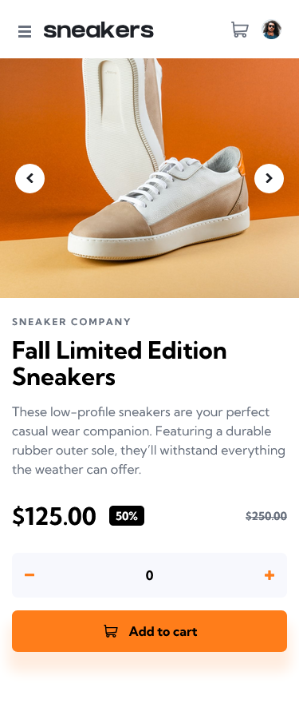
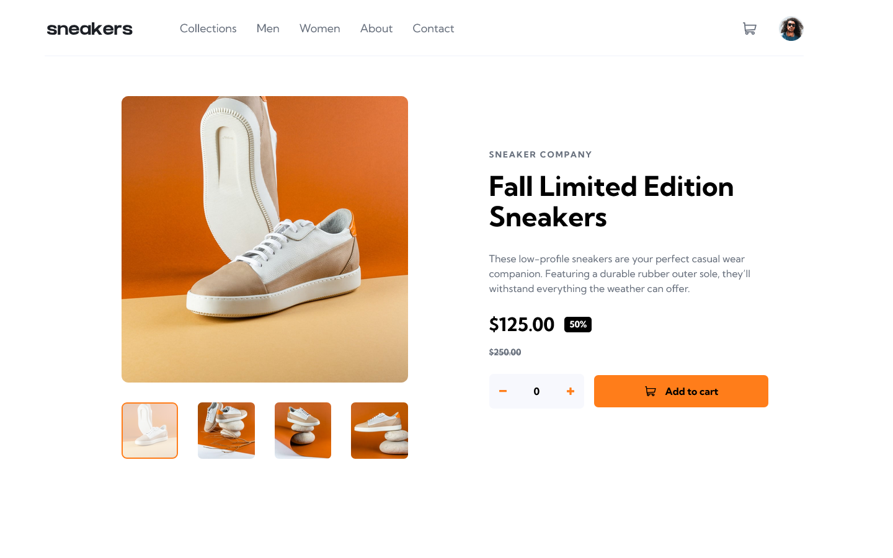

# Frontend Mentor - E-commerce Product Page Solution

This is my solution to the [E-commerce product page challenge on Frontend Mentor](https://www.frontendmentor.io/challenges/ecommerce-product-page-UPsZ9MJp6). This project helped me sharpen my frontend skills by building a responsive, interactive product page with accessibility and functionality in mind.

## Table of contents

- [Overview](#overview)
  - [The challenge](#the-challenge)
  - [Screenshot](#screenshot)
  - [Links](#links)
- [My process](#my-process)
  - [Built with](#built-with)
  - [What I learned](#what-i-learned)
  - [Continued development](#continued-development)
- [Author](#author)
- [Acknowledgments](#acknowledgments)

---

## Overview

### The challenge

Users should be able to:

- View the optimal layout for the site depending on their device's screen size
- See hover states for all interactive elements
- Open a lightbox gallery by clicking the large product image
- Switch product images using the thumbnail gallery
- Add and remove items in a shopping cart
- View cart quantity updates live

### Screenshot




### Links

- **Solution URL:** [Add solution URL here](https://github.com/PastaSus/ecommerce-product-page-main)
- **Live Site URL:** [Add live site URL here](https://pastasus.github.io/ecommerce-product-page-main/)

---

## My process

### Built with

- Semantic **HTML5**
- **CSS custom properties**
- **Flexbox** and **CSS Grid**
- **Vanilla JavaScript** (DOM manipulation and event handling)
- **Mobile-first workflow**
- ARIA roles and accessibility best practices

### What I learned

This challenge gave me deeper hands-on experience with:

- Writing accessible markup using ARIA attributes like `aria-controls`, `aria-expanded`, and `aria-live`
- Implementing modal/lightbox accessibility patterns
- Managing state (e.g. cart quantity, lightbox gallery) in vanilla JavaScript
- Structuring reusable and scalable CSS using utility classes and containers

#### Example: Accessible dynamic cart quantity

```html
<output class="product__quantity-value" aria-live="polite" aria-atomic="true">
  <span class="visually-hidden">Quantity:</span>
  <span class="product__quantity-number">0</span>
</output>
```

```css
.header__menu-item {
  padding: var(--spacing-32) 0;
  position: relative;
  transition: color 0.3s;
}
.header__menu-item::after {
  content: "";
  position: absolute;
  bottom: 0;
  left: 0;
  height: 3px;
  width: 100%;
  background-color: var(--Orange);

  transform: scaleX(0);
  transform-origin: left;
  transition: transform 0.3s ease-in-out;
}

.header__menu-item:focus::after,
.header__menu-item:hover::after,
.header__menu-item.active::after {
  transform: scaleX(1);
}
```

```js
// this renders the item elements first before it gets added to the list
function renderCartItem(product) {
  if (product.quantity === 0) return null;

  const cartItem = document.createElement("li");
  cartItem.classList.add("cart__item", "flex");

  // thumbnail
  const thumbnail = document.createElement("img");
  thumbnail.src = product.thumbnail;
  thumbnail.alt = "thumbnail of chosen product";
  thumbnail.className = "cart__item-thumbnail";

  // details wrapper
  const details = document.createElement("div");
  details.classList.add("cart__details", "flex");

  const name = document.createElement("p");
  name.className = "cart__item-name";
  name.textContent = product.name;

  const amount = document.createElement("p");
  amount.className = "cart__amount";
  // amount.classList.add = "flex";

  const priceSpan = document.createElement("span");
  priceSpan.className = "item__price";
  priceSpan.textContent = `$${product.price}`;

  const qtySpan = document.createElement("span");
  qtySpan.className = "item__qty";
  qtySpan.textContent = product.quantity;

  const totalSpan = document.createElement("span");
  totalSpan.className = "cart__total";
  totalSpan.textContent = `$${(product.price * product.quantity).toFixed(2)}`;

  amount.append(priceSpan, " x ", qtySpan, totalSpan);

  details.append(name, amount);

  const deleteBtn = document.createElement("button");
  deleteBtn.classList.add("cart__delete-item", "btn-reset");
  deleteBtn.type = "button";

  const deleteIcon = document.createElement("img");
  deleteIcon.src = "images/icon-delete.svg";
  deleteIcon.alt = "delete cart item";

  deleteBtn.appendChild(deleteIcon);

  // Final assemble of item
  cartItem.append(thumbnail, details, deleteBtn);

  deleteBtn.addEventListener("click", () => {
    delItem(deleteBtn);
  });

  return cartItem;
}
```

### Continued development

I want to use frameworks and be more efficient when coding in the future. And also make the profile btn work and checkout to the overall components of the site.

## Author

- Frontend Mentor - [@yourusername](https://www.frontendmentor.io/profile/PastaSus)
